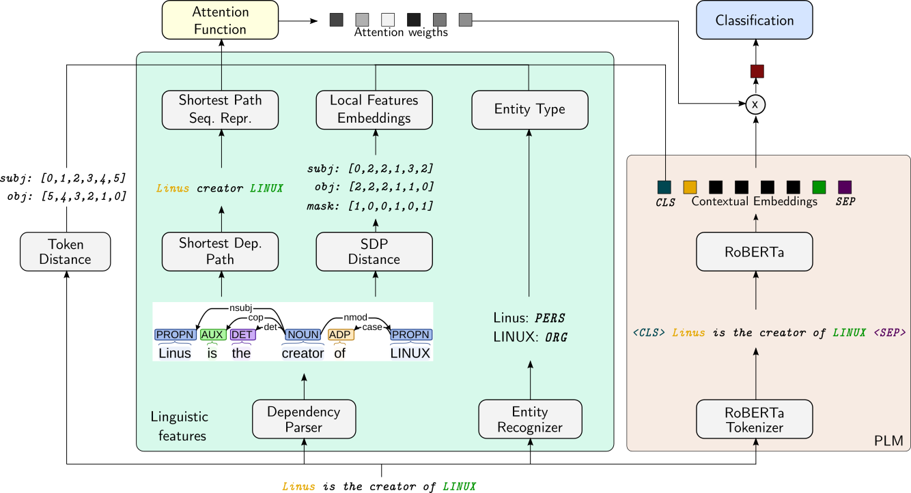

# Enriched Attention on PLM for Low-Resource Relation Extraction

This code is part of the Master's thesis in Computational Linguistics "Exploring Linguistically Enriched Transformers
for Low-Resource Relation Extraction".

This method aims to explore the incorporation of external linguistic knowledge from dependency parses onto a PLM  via
enriched attention. Dependency parses constitute a rich source of linguistic information and has been used
in many works before. A popular feature directly derived from dependency parses, The Shortest Dependency
Path between two entities, helps in masking irrelevant words influencing the relation of entities in a sentence.
The main idea is to include the information of dependency parses similarly to the work by
[Adel and Strötgen (2021)](https://arxiv.org/pdf/2104.10899.pdf),
but replacing the underlying LSTM recurrent neural network by a stack of transformers.
This research direction would also allow to study the implications in terms of performance of a fine-tuned
enriched-attention PLM (e.g. RoBERTa) compared to a more traditional sequential model.
Furthermore, it would be of interest to compare how the enriched attention mechanism impacts the performance
depending on the underlying attention-based network.


## Installation

The code in this repository is written in python using a bunch of libraries, including Pytorch and Transformers.
Using your favourite package manager (only `conda` was tested), create a new environment, and install the dependencies
included in `requirements.txt`.

If you are using `conda`, then type, replacing `<env>` with a valid environment name, in your favourite shell:
```bash
$ conda create --name <env> --file requirements.txt
```

## Usage and Syntax

Run the `main.py` file inside your python environment, e.g. by typing in the command line:
```bash
$ python main.py --help
```
This command will print out the command-line argument syntax and help.

To set up the batch size and the computing device (GPU supported) parameters, follow the syntax:
```bash
usage: main.py [-h] [--batch-size BATCH_SIZE] [--cuda-device gpu_id]
               {train} ...

```

Currently, the code can only train models given a dataset. The general training process
can be tuned by the following parameters:

```bash
usage: main.py train [-h] [--dropout-probability DROPOUT_PROBABILITY]
                     [--experiment-label EXECUTION_LABEL]
                     [--run-label RUN_LABEL] [--disable-mlflow] --tacred
                     TACRED [--mini-dataset]
                     [--no-eval-batches NO_EVAL_BATCHES]
                     [--learning-rate PLM PTL] [--epochs NO_EPHOCS]
                     [--print-every no_iterations]
                     [--plm-model-path PLM_MODEL_PATH]
                     [--figure-folder FIGURE_FOLDER] [--seed SEED]
                     {standard,ess,enriched_attention} ...
```
To learn more about these parameters, please check out the help by typing `python main.py train --help` in the shell.

The training process allows setting up and learning three different classification models for relation
extraction. On the one hand, schemas `standard` and `ess` are comprehensively described in the work by
[Soares et al. (2019)](https://arxiv.org/pdf/1906.03158.pdf). For further details, check out section 3.2.
On the other hand, the schema `enriched_attention` is an adaptation of the method proposed by
[Adel and Strötgen (2021)](https://arxiv.org/pdf/2104.10899.pdf), replacing the underlying LSTM by a
PLM.

For the `Enriched_Attention` schema, further parameters must be provided:
```bash
usage: main.py train enriched_attention [-h] [--attention-size ATTENTION_SIZE]
                                        [--dependency-distance-size DEPENDENCY_DISTANCE_SIZE]
                                        {additive,dot_product} ...
```

Once more, to learn more about the parameters and their default values, please check out the help by typing
`python main.py train enriched_attention --help` in your terminal.

## Datasets

As of today, the code only accepts TACRED-like datasets (JSON files). Parameter `--tacred` allows you to
indicate the folder where the tacred splits are located. This folder must contain files `train.json`, `dev.json`,
and `test.json` which correspond to the train, development and test splits, respectively.

# PLM-based Enriched Attention

This section describes comprehensively the proposed relation classifier
based upon the architecture of Adel & Strötgen (2021).
First the model will be described in
general terms. Then, we detail how the linguistic information is
included through the attention mechanism. Next, we describe the features
that can be used in the enriched attention module. Finally, we formally
define the classifier in mathematical terms.

## The Big Picture

In the following figure
can be seen an example architecture of the proposed relation extraction
method. It is worth noting that this structure may vary when different
linguistic information is used, although for illustrative purposes is
enough. The model consists of a total of four different modules
highlighted in color boxes:



-   **PLM**: It is depicted as a brown box. In this module we find the
    tokenizer and the transformer-based language model. As for the PLM,
    we decided to use RoBERTa, whose main purpose is to retrieve the contextual embeddings from
    the input sequence. The tokenization is handled by the RoBERTa
    tokenizer, which already knows how to map the input sequence into
    the pre-trained sub-tokens used in its internal representation. The
    tokenization process, as pointed out in the previous section,
    includes a pair of special tokens at the beginning (`[CLS]` token)
    and end of the sequence (`[SEP]` token) which represent the sentence
    and marks the beginning of a new sequence, respectively. The
    contextual embeddings retrieved by the PLM constitute the core
    information source that the network has for carrying out the
    classification of relations. Unlike the PLM baseline model
    introduced in the last section, the contextual representation of the
    model is weighted by the attention function prior to be passed to
    the final layer for classification.

-   **Linguistic features**: In the leftmost part of the figure,
    we can see the module that handles the linguistic information (green
    box). They can be computed on-the-fly by another NLP framework or be
    included directly through the training data. In our approach, the
    linguistic information is already included in the corpus, so the
    features can be extracted directly without the use of further
    machinery. In the example shown above, we can see that the input
    sequence is passed onto a dependency parser module to retrieve a
    parse tree. This step would be necessary if the corpus does not
    provide a dependency parses along with the sequences. The remainder
    of the module extracts linguistic features into two levels of
    granularity:
    local and global features. They essentially differ on the
    expressiveness level achieved by the information. Token-wise
    features are said to be local features, while sequence-wise features
    are said to be global features. These features, along with the
    global representation of the input sentence are the data source for
    the attention function. More details on the features can be found on
    the next section.

-   **Attention function**: It can be seen in the yellow box on top of
    the Linguistic Features module. It is responsible for weighting the
    contextual embeddings retrieved by the PLM module. The attention
    weights are function of the global and local features, as well as
    the global sentence representation, i.e. the `[CLS]` token. It features two different attention functions. They will be further
    discussed later.

-   **Classification**: It is highlighted in a blue box in the figure.
    It consists of (1) a fully connected layer that maps the
    representation obtained by the attention function over the
    contextual embeddings into a dimension equal to the number of
    different entity relations available in the corpus, and (2) a
    softmax classification which retrieves the probabilities of a given
    sequence to be any of the relation types available.

## Injected Linguistic Information & Linguistic Features

The linguistic features are the core source of information for the
Attention module. In this work, and similarly in the work by Adel and Strötgen (2021), we use
features based on the dependency parses of the input sequences, which
have been proven to be useful for relation extraction in many works
throughout the literature . The main intuition is that the dependency
parses carry information about the relation of the entities that the
plain sequence of tokens itself.

One popular feature is the Shortest Dependency Path (SDP) between two
entities in a dependency parse. It is defined as the sequence of tokens
resulting from traversing the dependency parse starting from entity one
to entity two in the minimum number of steps possible.

For example, given the input sequence “*Linus* is the creator of
*LINUX* ”, being *Linus* the entity one and *LINUX* the entity two, as
well as the dependency parse shown in the figure above,
the SDP for this particular sequence and dependency parse is the
sequence of tokens `"Linus creator LINUX"`.

In this toy example, it can be seen that the shortest dependency path
includes, besides the entities themselves, the word *creator*, which is
of high relevance for retrieving the correct relation.

Some works in the literature use directly the SDP to feed a language
model, but following such approach entails potential risks. In the
presence of noise or incorrect dependency parses it is possible that the
extracted SDP disregards potentially useful information in the input
sequence. In this sense, including SDP related features as a signal for
the attention layer allows it to learn to ignore misleading dependency
parses.

The Entity Type of an entity mention also provides valuable linguistic
information for relation extraction. Knowledge about the types can
shorten the search space of possible relations. For example, in the
sequence “Barack Obama Sr. the father of Barack Obama was born in 1936”,
with entities being “Barack Obama Sr.” and “1936”, knowing that the
second entity is of type `date`, can help the model exclude relations
e.g. `city_of_birth` which most likely will require an entity of type
`location` .

### Enhanced Dependencies

We intend to study the impact of Enhanced Dependencies (ED) in our
enriched attention method. Universal Dependencies (UD) extracted from
regular dependency parses can provide a lot of information about the
type of relation between two entity mentions.
However, for some input sequences, the resulting SDP between two entity
mentions can be long enough that difficult determining the relation
type.

The Enhanced UD graphs , is a representation of parses which makes the
implicit relations of entity mentions more explicit, while augmenting
the dependency labels to disambiguate types of arguments and modifiers.
This is achieved by augmenting the data structure from a tree to a
graph, enabling each token in the input sequence to have more than one
parent in the parse. This enhanced representation allows finding
shortcuts when calculating the SDP, potentially increasing the
performance. For relation extraction, these shortcuts often imply
getting a more condensed list of tokens involving the entity mentions,
and in consequence, a less noisy SDP feature. Making use of ED in our
code implies adjusting the function extracting the SDP – finding the
shortest path between two nodes in a graph can be achieved by e.g.
Dijkstra’s algorithm.

### Dependency Distance Feature

The Dependency Distance is a local feature that is directly extracted
from the dependency parse of a given sequence. For retrieving it, we
need to calculate the distance for each token in the sequence to each
one of the entity mentions. Taking our sequence example “*Linus* is the
creator of *LINUX*” along with its dependency parse shown in the figure above,
we can determine that the distances of each token to the first entity
(often referred as `subj`) are 0, 2, 2, 1, 3, and 2, respectively.
Distances to the second entity mention (i.e. `obj`) would be computed
similarly.

In the network, we represent the distances in a multidimensional space.
Formally, we define
$\mathbf{d}^{e_1} \in \mathbb{R}^D$ and
$\mathbf{d}^{e_2} \in \mathbb{R}^D$ as the dependency distance
embeddings to `subj` and `obj`, respectively. Furthermore, we define a
flag $f\in \{-1,1\}$ which indicates if a token is on the SDP. The
dependency distance feature $\mathbf{l} \in  L=\mathbb{R}^{2D+1}$ is the
concatenation of its distance embeddings $\mathbf{d}^{e_1}$ and
$\mathbf{d}^{e_2}$ plus the SDP flag $f$, i.e. $$\begin{aligned}
    \mathbf{l} := \left<\mathbf{d}^{e_1}|\mathbf{d}^{e_2}|f\right>\,.\end{aligned}$$

### Shortest Path Feature

The Shortest Path (SP) is a global feature extracted directly from the
derived SDP of a sequence. The feature is a contextual
representation of the SDP sequence itself. The actual implementation of
this feature in this work differs from the approach used in the original
work, where Adel & Strötgen (2021) used the last hidden state of a separate
LSTM model.

In our approach, we share the RoBERTa PLM used in the input sequence to
get the representation of the SDP. This implicates having a separate
tokenization process for the SDP and fine-tuning the PLM model for two
different tasks at the same time.

We define the shortest path feature
$\mathbf{s}\in S = \mathbb{R}^m$ as the first hidden state of the last
hidden layer $H^{(\text{SDP})}$ of the function
$\text{RoBERTa}_{\tilde{\theta}}$ with parameters $\tilde{\theta}$
evaluated on the SDP $\mathbf{u}$, namely $$\begin{aligned}
    H^{(\text{SDP})}&=  \text{RoBERTa}_{\tilde{\theta}} (\mathbf{u}) \,,\\
    \mathbf{s} &:= \mathbf{h}^{(\text{SDP})}_0\,;\end{aligned}$$ where
$\mathbf{u}$ is the sequence of tokens that the SDP consists of expanded
with the \[`CLS`\] and \[`SEP`\], similar to the input sequence of
tokens $\mathbf{x}$.

### Entity Types Feature

The Entity Type (ET) is a global feature that aims to represent the
types of the two entity mentions. We extract the entity types of the
entity mentions automatically from an entity named recognition task, and
we embed them into a vector space. We define
$\mathbf{t}^1, \mathbf{t}^2 \in \mathbb{R}^T$ as the representations for
the types of entity one and entity two, respectively.

The entity type feature $\mathbf{e}\in \mathbb{R}^{2T}$ becomes the
concatenation of both representations, i.e. $$\begin{aligned}
    \mathbf{e}:= \left<\mathbf{t}^1|\mathbf{t}^2\right>\,.\end{aligned}$$

## Attention Function

This section shows how the linguistic features and the sequence
representation of the PLM integrates in the attention function. The attention function is responsible from producing the attention scores that can be used afterwards for calculating the attention weights applied to the
contextual embeddings. In both approaches, the softmax function is used
to retrieve the attention weights. In this work however, we focused on
implementing additive attention.

Formally, the attention score $e_i$ for the $i$-th token is calculated
as $$\begin{aligned}
    e_i = v^\top\tanh\left( W_h \mathbf{h}_i + W_q \mathbf{h}_0 + W_s \mathbf{p}^s_i + W_o\mathbf{p}^o_i+ W_l \mathbf{l}_i + W_g \mathbf{g}\right)\,,\end{aligned}$$
where $v \in \mathbb{R}^A$ $W_h, W_q \in \mathbb{R}^{A\times m}$,
$W_s, W_o \in \mathbb{R}^{A\times P}$, $W_l \in \mathbb{R}^{A\times L}$,
and $W_g \in \mathbb{R}^{A\times G}$ are trainable parameters. First,
$\mathbf{h}_i$ corresponds the $i$-th state of the last hidden layer of
the RoBERTA PLM, whereas $\mathbf{h}_0$ is the representation of the
`[CLS]` token. Next, $\mathbf{p}^s_i, \mathbf{p}^o_i \in \mathbb{R}^P$
are positional embeddings that encode the distance of the $i$-th token
in the sequence to the first and last entity mention, respectively.
Finally, $\mathbf{l}_i \in \mathbb{R}^{2D+1}$ is the local feature for
token $i$ and $\mathbf{g} \in \mathbb{R}^G$ corresponds to the global
feature $\mathbf{s}$ or $\mathbf{e}$.

## Formal Definition


Let $$\mathbf{\bar{x}} = [x_0,x_1,\ldots,x_n] \in \bar{X}$$ be a
sequence of tokens and let
$$\mathbf{x} = [\text{[\texttt{CLS}]},x_0,x_1,\ldots,x_n, \text{[\texttt{SEP}]}] \in X$$
be the augmented sequence of tokens of $\mathbf{\bar{x}}$ which includes
the \[`CLS`\] and \[`SEP`\] tokens.

We define the function $\text{AUGMENT} : \bar{X} \rightarrow X$ such
that $$\begin{aligned}
    \mathbf{x} = \text{AUGMENT}(\mathbf{\bar{x}})\,.\end{aligned}$$

Let $\mathbf{s}_1 = (i,j)$ and $\mathbf{s}_2 = (k,l)$ be pair of
integers such that $$0 < i < j < n\,, \quad 0 <k < l < n\,,$$ where
$k < i$ or $k > j$.

We define a relation statement triple
$$\mathbf{r} = (\mathbf{\bar{x}}, \mathbf{s}_1, \mathbf{s}_2)$$ as the
sequence of tokens $\mathbf{x}$ with entity mentions sequences in the
form of $[x_i,\ldots, x_j]$ and similarly $[x_k,\ldots,x_l]$.

Let $\mathbf{d} \in \mathcal{D}$ be a sequence of integers
$$\begin{aligned}
    \mathbf{d} = [d_1,d_2,\ldots,d_n]\end{aligned}$$ encoding the parent
nodes of each token in a dependency parse, $t\in \mathcal{T}$ be a
relation type where $\mathcal{T}$ is a fixed set of relation types and
$\mathbf{r}\in \mathcal{R}$ be a relation statement where $\mathcal{R}$
is the set of all possible relation statements.

We define the corpus
$\bar{D} = [(\mathbf{r}_0, \mathbf{d}_0 ,t_0), (\mathbf{r}_1, \mathbf{d}_1, t_1), \ldots, (\mathbf{r}_N, \mathbf{d}_N, t_N)]$
as a set of 3-tuples consisting of the relation, its dependency parse
and its relation type.

The goal is to learn a function
$F_\theta : \mathcal{R}\times\mathcal{D} \rightarrow \mathcal{T}$ with
parameters $\hat{\theta }\in \Theta$ such that
$$\hat{\theta} = \mathop{\mathrm{arg\,min}}_{\theta\in\Theta} \sum_{(\mathbf{r}, \mathbf{d}, t)\in \bar{D}} \mathcal{L}(t, f_\theta(\mathbf{r}, \mathbf{d}))\,,$$
where $\mathcal{L}$ is the negative log-likelihood loss function
$$\begin{aligned}
\mathcal{L}(t, \hat{\mathbf{t}}) = -\sum_{i=0}^{|\mathcal{T}|}t\log\hat{t}_i\,,\end{aligned}$$
and $f_\theta : \mathcal{R}\times \mathcal{D}\rightarrow \mathbb{R}^n$
is a relation classifier that yields the probabilities of a relation $r$
for each type $t\in\mathcal{T}$ with parameters $\theta$.

On the one hand, we define the functions
$\text{DEP\_DISTANCE} : \bar{X} \times \mathcal{D} \rightarrow L^n$ and
$\text{SDP} : \bar{X}\times \mathcal{D} \rightarrow S^n$ as the mapping
from a sequence of tokens along with its dependency parse into the
dependency distance and SDP features, respectively.

On the other hand, we define the function
$\text{RoBERTa}_{\tilde{\theta}}: \tilde{X} \rightarrow \mathcal{H}$ as
a function that retrieves the last hidden layer $H \in \mathcal{H}$ of
the RoBERTa PLM with pretrained parameters $\tilde{\theta}$, where
$H = [\mathbf{h}_0,\mathbf{h}_1,\ldots, \mathbf{h}_{|\tilde{x}|}]$, and
$\mathbf{h} \in \mathbb{R}^m$.

Finally, let
$\text{ATTENTION}: \mathcal{H} \times S^n \times L^n \rightarrow \mathbb{R}^n$
be a function that calculates the attention scores from the contextual
embeddings, local and global features.

Our relation classifier function $f_\theta$ is therefore defined as
$$\begin{aligned}
H &= \text{RoBERTa}_{\tilde{\theta}}( \text{AUGMENT}(\bar{\mathbf{x}} ))\,,\\
f_\theta (\bar{\mathbf{x}}, \mathbf{s}_1, \mathbf{s}_2, \mathbf{d}) &=  \text{softmax}[\\
&W_{\text{out}}
[H \otimes \text{ATTENTION}(H, \text{SDP}(\mathbf{\bar{x}}, \mathbf{d}), \text{DEP\_DISTANCE}(\mathbf{\bar{x}}, \mathbf{d}))] +  \mathbf{b}_\text{out}]\,;\end{aligned}$$
where $\otimes$ represents the tensor product, and
$W_\text{out}\in \mathbb{R}^{|\mathcal{T}|\times m}$ and
$\mathbf{b}_\text{out} \in \mathbb{R}^{|\mathcal{T}|}$ are the randomly
initialized learnable parameters of the output layer and
$\tilde{\theta}$ are the pre-trained parameters of the RoBERTa model
that are fine-tuned.

## Contributing
Pull requests are welcome. For major changes, please open an issue first to discuss what you would like to change.

## License
This work is licensed under the terms of the GPL-3.0 license.
